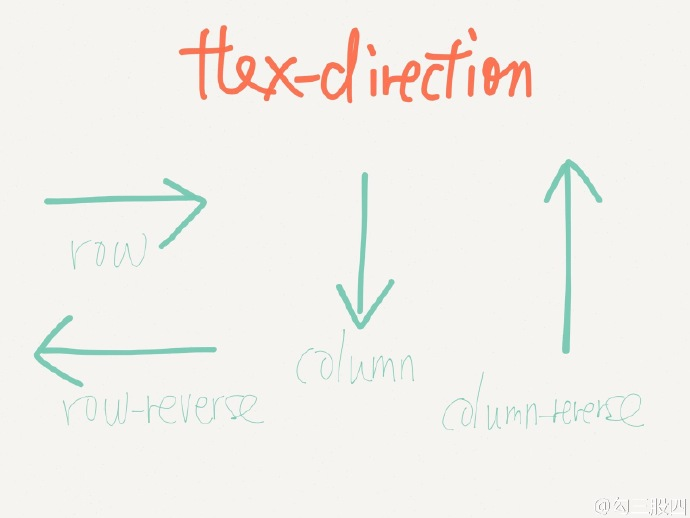
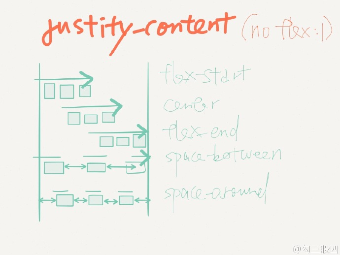

# RN学习总结

### 常见命令:

`react-native init **`

`react-native -help`

`npm install`:安装工程目录下的包依赖

`package.json`类似于cocoaPods中的Podfile

([React Native Package Manager包管理器介绍](http://blog.csdn.net/offbye/article/details/51586273))

`react-native run-ios`

`react-native run-android`

`react-native log-ios`

`console.warn();`

`console.error();`

1.`AppRegistry`模块则是用来告知React Native哪一个组件被注册为整个应用的根容器。`AppRegistry.registerComponent`这个方法只会调用一次.

2.`props`和`state`:

`props`(属性):大多数组件在创建时就可以使用各种参数来进行自定制,用于定制的这些参数就称为`props`.

自定义的组件也可以使用`props`。通过在不同的场景使用不同的属性定制，可以尽量提高自定义组件的复用范畴。常见的使用方式有在父级使用子级控件,传递某个属性的值给子类的`props`.

```JavaScript
class Greeting extends Component {
  render() {
    return (
      //获取当前类的prop属性
      <Text>Hello {this.props.name}!</Text>
    );
  }
}
```
```javascript
//name作为props属性传递给Greeting子类
<Greeting name='Rexxar' />
```

`props`是在父组件中指定，而且一经指定，在被指定的组件的生命周期中则不再改变。

对`props`赋值时有时需要用括号包括,括号的意思是括号内部为一个JS变量或表达式，需要执行后取值。因此我们可以把任意合法的JavaScript表达式通过括号嵌入到JSX语句中。

对于需要改变的数据，我们需要使用`state`。一般需要在`constructor`中初始化`state`,然后在需要改变的时候调用`setState`方法.

3.`style`:
在设置`style`时,可以传入一个数组.在数组中位置居后的样式对象比居前的优先级更高，可以间接实现样式的继承。后声明的属性会覆盖先声明的同名属性.

固定宽高:RN中的尺寸都是无单位的，表示的是与设备像素密度无关的逻辑像素点。
弹性(flex)宽高:可以使控件可利用的空间中(控件大小要固定)动态地扩张或收缩.可以做出复杂的Stack类型布局.

4.FlexBox布局:

`flexGrow`,`flexShrink`:设置子元素的伸缩能力是其他子元素伸缩值的多少倍.

`flexBasis`:设置伸缩基准值,剩余的空间将按照比例进行伸缩.默认值`auto`.

1.`flexDirection`:决定布局的**主轴**,也是flex切分界面布局方向.默认值是`column`.

`row`:水平轴

`column`:竖直轴

`row-reverse`/`column-reverse`:对应方向的反向布局



2.`flexWrap`:主要用来定义当伸缩容器里单行显示不完整时是单行还是多行显示,侧轴的方向决定了新行显示的方向.默认值是`nowrap`.

`wrap`, `nowrap`,`wrap-reverse`


3.`justifyContent`:决定组件其子元素沿着**主轴**的对齐方式(此样式设置在父元素上).

`flex-start`(靠近主轴始端)、`center`、`flex-end`(靠近主轴末端)、`space-around`(等比分割元素间的间隔,两端保留一半的空间)以及`space-between`(等比分割元素间的间隔,两端不保留空间)。



4.`alignItems`:决定组件其子元素沿着**次轴**的对齐方式(此样式设置在父元素上).默认值为`stretch`.

`auto`、`flex-start`、`center`、`flex-end`以及`stretch`(使用时子元素在次轴方向上不能有固定的尺寸)。


`alignSelf`:决定了元素在父元素的**次轴**方向的排列方式（此样式设置在子元素上）,其值会覆盖父元素的`alignItems`的值.默认值为`auto.`
`auto`, `flex-start`, `flex-end`, `center`, `stretch`


5.`padding`:`paddingTop`,`paddingBottom`,`paddingLeft`, `paddingRight`,`paddingHorizontal`,`paddingVertical`设置组件(上左下右,横竖)填充的宽度

`margin`:`marginTop`,`marginLeft`,`marginBottom`,`marginRight`,`marginHorizontal`,`marginVertical`:设置组件(上左下右,横竖)边缘宽度

`borderWidth`:`borderBottomWidth`,`borderLeftWidth`,`borderRightWidth`,`borderTopWidth`:设置组件边界宽度

`borderColor`:设置对应边界(上左下右)的颜色,`borderRadius`:设置对应边界(上左下右)的角度,`borderStyle`:设置边界样式(`solid`,`dotted`,`dashed`)


`top`,`left`,`bottom`,`right`,`height`,`width`,`maxHeight`,`maxWidth`,`minHeight`,`minWidth`:设置组件上左下右边距和宽高,设置对应值时需要先确定`position`

`position`:设置元素在父元素中的位置.`absolute`(绝对),`relative`(相对,默认值)([Absolute positioning](https://facebook.github.io/yoga/docs/absolute-position/))

`overflow`:`visible`,`hidden`,`scroll`:设置超出组件部分的内容是否隐藏

`zIndex`:设置元素在父视图中的层级位置

[CSS3 Flexbox 口诀](http://weibo.com/1712131295/CoRnElNkZ?ref=collection&type=comment#_rnd1488350143824)

[一个完整的Flexbox指南](http://www.w3cplus.com/css3/a-guide-to-flexbox.html)

5.资源设置

使用图片资源时需要预先知道图片的大小尺寸.(避免加载时界面重新设置图片的闪动)

`Image`对象的属性`source`正确设置方法是传入一个带有`uri`属性的对象.

1.静态资源:

可以引用`my-icon.ios.png`和`my-icon.android.png`,`check@2x.png`和`check@3x.png`格式图片,系统会自动选择相应图片.

可以设置资源的相对位置和绝对位置.

```JavaScript
//require中的图片名字必须是一个静态字符串
var icon = this.props.active ? require('./my-icon-active.png') : require('./my-icon-inactive.png');
<Image source={icon} />
```

2.网络资源:使用网络图片资源,必须设置图片大小尺寸

```JavaScript
<Image source={{uri: 'https://facebook.github.io/react/img/logo_og.png'}}
       style={{width: 400, height: 400}} />
```

3.使用混合App中的资源:


6.`ScrollView`:是个通用的可滚动容器,其内可以放入多种不同的组件和视图.

`Scrollview`组件实质上是把不确定高度的子组件放在**确定高度**的容器中,所以必须有一个确定的高度.

`ScrollView`中所有的组件都会被渲染,不考虑组件的重用.适合短列表数据展示.

`contentContainerStyle`:

7.`ListView`:

`ListView`不是立即渲染所有元素,而是优先渲染屏幕范围内的元素.且元素个数可以增删.适合长列表数据.

`ListView`必须实现的两个属性:`dataSource`(数据源)和`renderRow`(渲染某行的组件).

`renderSectionHeader`:渲染listView分区头部,可以使用`stickySectionHeadersEnabled`控制区头部分是否跟随listView移动

`renderSeparator`:设置分割线样式

`rowHasChanged`:

8.`Navigator`:父子传值时,使用`params`传递参数

界面间的相互传值:

```JavaScript
//第一个界面
navigator.push({
  component:SecondView,
  // QUESTION: params,passProps
  params:{
    name:'张三',
    //传递给下一界面一个方法
    changeName:function(name){
      console.warn(`下一界面传过来的name:`+name);
    },
  },
});
```

```JavaScript
//第二个界面
this.props.changeName(`李四`);
this.props.navigator.pop();
```

`initialRoute`:定义启动时加载的路由

`initialRouteStack`:初始化路由集合

`renderScene`:指定路由的界面渲染

`navigationBar`:设置导航栏

* `getCurrentRoutes()` - 获取当前栈里的路由，也就是push进来，没有pop掉的那些。
* `jumpBack()` - 跳回之前的路由，当然前提是保留现在的，还可以再跳回来，会给你保留原样。
* `jumpForward()` - 上一个方法不是调到之前的路由了么，用这个跳回来就好了。
* `jumpTo(route)` - 跳转到已有的场景并且不卸载。
* `push(route)` - 跳转到新的场景，并且将场景入栈，你可以稍后跳转过去
* `pop() `- 跳转回去并且卸载掉当前场景
* `replace(route)` - 用一个新的路由替换掉当前场景
* `replaceAtIndex(route, index)` - 替换掉指定序列的路由场景
* `replacePrevious(route)` - 替换掉之前的场景
* `resetTo(route)` - 跳转到新的场景，并且重置整个路由栈
* `immediatelyResetRouteStack(routeStack)` - 用新的路由数组来重置路由栈
* `popToRoute(route)` - pop到路由指定的场景，在整个路由栈中，处于指定场景之后的场景将会被卸载。
* `popToTop()` - pop到栈中的第一个场景，卸载掉所有的其他场景。

[navigator](https://facebook.github.io/react-native/docs/navigator.html)

9.`NavigatorIOS`:

在`initialRoute`中设置nav属性和配置,`component`(Function类型),`title`,`leftButtonTitle`,`leftButtonIcon`(传递图片资源地址),`onLeftButtonPress`,`rightButtonTitle`,`rightButtonIcon`,`onRightButtonPress`,`passProps`(传递字典数据)

`barTintColor`,`tintColor`,`titleTextColor`控制控件显示颜色

`navigationBarHidden`:控制导航栏是否隐藏

`shadowHidden`:控制导航栏是否隐藏1像素的阴影

`translucent`:设置导航栏半透明效果

常见方法:`push`(可在内部设置下一个界面的nav属性和配置),`pop`,`replace`,`popToTop`

10.`TouchableHighlight`和`TouchableOpacity`:

他们都继承自`TouchableWithoutFeedback`,常见的方法有:`onPress`,`onLongPress`,`onPressIn`,`onPressOut`,属性:`disabled`,`hitSlop`(设置触摸范围的大小,但不会超过父视图的边界)

前者点下后视图不透明度会降低,底层的渲染颜色会被用户看到,使得视图变亮或者变暗.会出现副作用,建议少用.

后者点下后视图的不透明度也会降低,但是没有额外的颜色变化.建议使用.

11.`WebView`

`source`同`Image`的使用方法

`automaticallyAdjustContentInsets`,`contentInset`

`onError`,`onLoad`,`onLoadStart`,`onLoadEnd`,`onMessage`,`onNavigationStateChange`,`renderError`(返回一个视图用于显示错误界面),`renderLoading`(返回一个视图用于显示加载界面)

12.`PanResponder`:事件的响应链同原生,由父级View底层向上层冒泡传递

`Responder`与`PanResponder`功能类似

主要生命周期:

`View.props.onStartShouldSetResponder: (evt) => true`, - 在用户开始触摸的时候（手指刚刚接触屏幕的瞬间），是否愿意成为响应者？

`View.props.onMoveShouldSetResponder: (evt) => true`, - 如果View不是响应者，那么在每一个触摸点开始移动（没有停下也没有离开屏幕）时再询问一次：是否愿意响应触摸交互呢？

View尝试成为响应者时:

`View.props.onResponderGrant: (evt) => {}` - View现在要开始响应触摸事件了。这也是需要做高亮的时候，使用户知道他到底点到了哪里。

`View.props.onResponderReject: (evt) => {}` - 响应者现在“另有其人”而且暂时不会“放权”，请另作安排。

View已开始响应触摸事件:

`View.props.onResponderMove: (evt) => {}` - 用户正在屏幕上移动手指时（没有停下也没有离开屏幕）。

`View.props.onResponderRelease: (evt) => {}` - 触摸操作结束时触发，比如"touchUp"（手指抬起离开屏幕）。

`View.props.onResponderTerminationRequest: (evt) => true` - 有其他组件请求接替响应者，当前的View是否“放权”？返回true的话则释放响应者权力。

`View.props.onResponderTerminate: (evt) => {}` - 响应者权力已经交出。这可能是由于其他View通过onResponderTerminationRequest请求的，也可能是由操作系统强制夺权（比如iOS上的控制中心或是通知中心）。

`nativeEvent`:`changedTouches`,`identifier`,`locationX`,`locationY`,`pageX`,`pageY`,`target`,`timestamp`(触摸事件的时间戳，可用于移动速度的计算),`touches`(当前屏幕上的所有触摸点的集合)

`gestureState`:`stateID`,`moveX`,`moveY`,`x0`,`y0`,`dx`,`dy`,`vx`,`vy`,`numberActiveTouches`

`Platform`:

`Platform.OS`
```javascript
//判断平台的系统
Platform.OS === 'android'
```

`Platform.select`

```javascript
//返回当前包含`Platform.OS`为key的对象
Platform.select({
  ios:{
    backgroundColor:'red',
  },
  android:{
    backgroundColor:'yellow',
  },
})
```

`Platform.Version`

还可以使用`BigButton.ios.js`,`BigButton.android.js`等带`.ios`或者`.android`的后缀js文件,导入依赖关系时会自动识别平台

### 常用的第三方:
[react-navigation(推荐使用)](https://github.com/react-community/react-navigation)

[react-native-viewpager：可实现轮播图效果](https://github.com/race604/react-native-viewpager)

[react-native-tab-navigator：可用于构建跨平台Tab，并可以轻松地进行页面切换](https://github.com/exponentjs/react-native-tab-navigator)

[react-native-elements](https://github.com/react-native-community/react-native-elements.git):含有常用的icon,按钮,表单,列表,搜索框,复选框,segmentButton等功能
